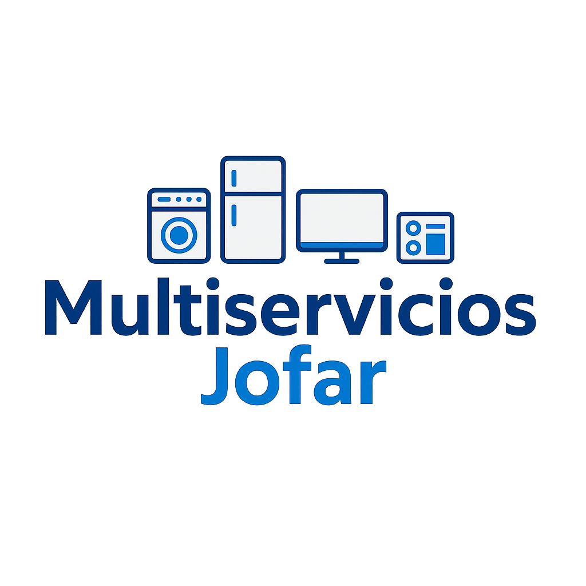

# 🛠️ Landing Page - Multiservicios Jofar



## 📋 Descripción

Landing page moderna, responsiva y optimizada para **Multiservicios Jofar**, empresa especializada en reparación y mantenimiento de electrodomésticos, ubicada en **Paita, Perú**.  
Diseñada para brindar una experiencia de usuario clara, rápida y enfocada en la conversión.

## ✨ Características

### 🎯 Diseño y UX
- Diseño completamente **responsive** (Mobile First)
- Estilo moderno con efecto **glassmorphism**
- Animaciones suaves con **AOS (Animate On Scroll)**
- Navegación fluida y accesible

### 📱 Secciones
- **Inicio**: Presentación con llamados a la acción
- **Servicios**: Grid dinámico de servicios ofrecidos
- **Sobre Nosotros**: Historia, misión y visión
- **Contacto**: Formulario funcional y enlaces directos

### 💼 Funcionalidades
- Envío de correos a través de **EmailJS**
- Validación de datos en tiempo real
- Envío automático de copia al cliente
- Integración con **WhatsApp** y redes sociales
- Menú mobile animado y accesible

## 🛠️ Tecnologías Usadas

- HTML5 / CSS3 / JavaScript (ES6)
- [EmailJS](https://www.emailjs.com/) - Servicio de correo desde el frontend
- [AOS](https://michalsnik.github.io/aos/) - Librería de animaciones al hacer scroll
- [Font Awesome](https://fontawesome.com/) - Iconografía profesional

## 📁 Estructura del Proyecto

```
jofar-landing-page/
├── css/
│   ├── layout.css
│   ├── home.css
│   ├── services.css
│   ├── about.css
│   └── contact.css
├── js/
│   ├── config.js       # IDs y claves públicas de EmailJS
│   ├── formHandler.js  # Validaciones y lógica de envío
│   └── scripts.js      # Comportamientos generales
├── images/             # Imágenes y logos
└── index.html
```

## 🚀 Cómo usar

> Este proyecto no requiere instalación de dependencias. Solo descarga y abre el archivo `index.html` en tu navegador.

### Opción 1: Descargar

1. Descarga el ZIP desde GitHub
2. Extrae los archivos en tu equipo
3. Abre `index.html` en tu navegador

### Opción 2: Clonar el repositorio

```bash
git clone https://github.com/tu-usuario/jofar-landing-page.git
```

## 📧 Configuración de EmailJS

1. Crea una cuenta en [EmailJS](https://www.emailjs.com/)
2. Crea un **servicio** de correo (Gmail, Outlook, etc.)
3. Configura **dos plantillas de correo**:
   - Una para el administrador (notificación)
   - Otra para el cliente (auto-respuesta)
4. Copia los IDs y colócalos en `js/config.js`

> No uses variables de entorno `.env`, ya que este proyecto es 100% frontend. Usa solo claves públicas y mantén tu cuenta segura.

## 🔐 Seguridad

- Solo se usan **claves públicas** en `config.js`
- **No expongas claves privadas** o credenciales sensibles
- No necesitas `.env` ni backend, pero puedes ocultar `config.js` en producción si alojas en un servidor

## 🌐 Compatibilidad

- ✅ Chrome
- ✅ Firefox
- ✅ Safari
- ✅ Edge
- ✅ Dispositivos móviles y tablets

## 📬 Contacto

- 📧 Correo: farfan463@gmail.com  
- 📱 WhatsApp: [+51 973027399](https://wa.me/51973027399)  
- 📘 Facebook: [@electronicajofar](https://www.facebook.com/electronicajofar/)  
- 📍 Dirección: Av. Victor Raul Mz C Lote 24, Paita, Piura

## 📝 Licencia

© 2025 Multiservicios Jofar – Todos los derechos reservados.  
Desarrollado con ❤️ por Johanatan Cristhian Farfan Castillo.
